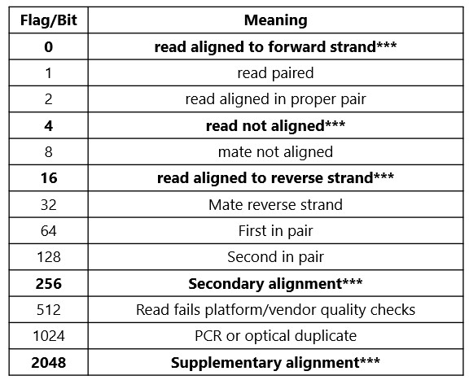

---
tags:
    - Alignment
    - Flags
    - Bash
---

# Fun with (alignment) flags

---

## Overview

Filtering sequence read alignments based on their alignment flag (SAM/BAM column 3) is extremely useful for evaluating the mapping quality of read alignments and inferring strandedness. It is also possible to filter 
SAM/BAM files to retain only alignments with specific alignment flags.



*** flags relevant to nanopore DRS and derivatives


### Nanopore considerations
Nanopore datasets comprise single-end reads. A common step in processing nanopore datasets is to retain only primary alignments for downstream processing. This can be accomplished when converting between SAM to BAM e.g.

``` samtools view -F 2308 -o filtered.bam in.sam ```

The sum total of nanopore-related flags is 0+4+16+256+2048 = 2324. Subtracting 0+16 (primary alignments against forward and reverse strand) gives 2308. The -F flag acts to exclude all bits that can be used to make 2308 (e.g. 4+256+2048).

Filtering for reverse strand alignments only can thus be accomplished with -f 16 (primary only) or -f 2320 (primary, secondary, and supplementary)

Filtering for primary forward strand alignments only requires -F 2324


### Illumina considerations
Illumina datasets may be unpaired (single-end, one read per fragment) or paired-end (two reads per fragment). For unpaired reads, the rules outlined above for nanopore remain valid. For paired-end reads, alignment flag operations are a little more complex.

Examples:
- a correctly paired primary alignment with R1 aligning to the forward strand would have a value of 0+1+2+32+64 = 99
- a correctly paired primary alignment with R2 aligning to the forward strand would have a value of 0+1+2+32+128 = 163
- an incorrectly paired primary alignment with R2 aligning to the reverse strand could have a value of 1+16+128 = 145 (implies mate is aligned to same strand)


## Further reading

[Alignment flag decoder](http://broadinstitute.github.io/picard/explain-flags.html)
