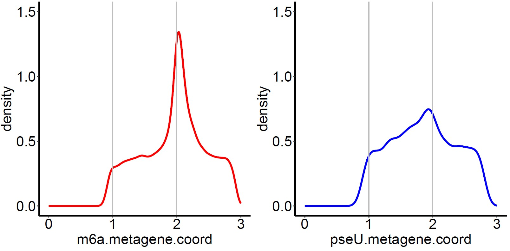
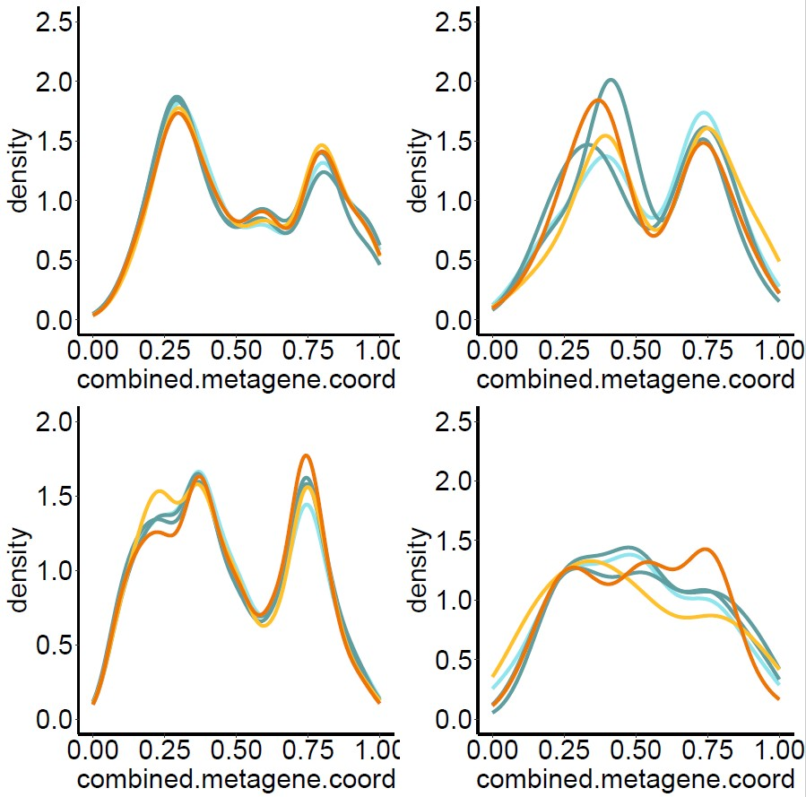

---
tags:
    - Metaplot
---

# Metaplot

---

## Overview

Metaplots are density plots / histograms showing the clustering of sites of interest (e.g. RNA modifications) along simplified transcript models. They can be generated from datasets aligned against either the genome
or transcriptome of a well annotated organism, typically the human genome (HG38). Below you will find information on how to generate different types of metaplot.


## Analysis of m6A and pseU on HG38 poly(A) RNAs using R (transcriptome level)
input files:
- modkit BED file (generated using modkit) containing modification calls against transcriptome alignments
- hg38-output.txt data file which described the UTR and CDS regions of all currently annotated HG38 Ensembl transcripts (obtain from Dan or generate yourself (see below)

The R script, txome-metaplot.R (AGDepledge/scripts/), can be used to process such an input file and produce an analysis of m6A and pseU density across sequenced RNAs. The output highlight distinct regions such as 
the 5' UTR (0-1), CDS (1-2), and 3' UTR (2-3).



<br><br>

## Analysis of m6A on HG38 RNAs using R (genome level)
input files:
- latest gencode predictions (obtained via UCSC Table browser) in genepred format
- reduced modkit BED files containing modification calls against genome alignments
- assorted python and R scripts (AGDepledge/scripts/)

While more complicated than analyses of transcriptome-level alignments, genome-level alignments may be preferred in many cases. The following described how to generate genome-level metaplots when using standard DRS approaches. This approach can be applied to all modifications that can be natively called by Dorado.

#### 1. Navigate to [UCSC Table browser](https://genome.ucsc.edu/cgi-bin/hgTables)
- set assembly to Dec. 2013 HG38
- set track to All Gencode V47 (or later version)
- set table to Basic(wgEncodeGencodeBasicV47)
- set output file name to hg38_gencode_v47.genePred
- download

#### 2. Make annotation and region_sizes files - this creates a very large master annotation file (bed format) of every nucleotide in the transcriptome. Then sort and remove unsorted version before generation a region_sizes file. The region_sizes file catalogs the transcriptomic coordinates of the start and end sites of the transcript regions (i.e. 5’UTR, CDS and 3’UTR). Note that this step only needs to be performed once and the only reason to generate a new version is when a later gencode annotation version is desired.

```
    python make_annot_bed.py --genomeDir /project/sysviro/data/reference_genomes/Homo_sapiens/UCSC/hg38/Sequence/Chromosomes/ --genePred hg38_gencode_v47.genePred > hg38_annot_gencode_v47.bed

    sort -k1,1 -k2,2n hg38_annot_gencode_v47.bed > hg38_annot_gencode_v47.sorted.bed

    rm hg38_annot_gencode_v47.bed

    python size_of_cds_utrs.py --annot hg38_annot_gencode_v47.sorted.bed > gencode_v47_region_sizes.txt
```

#### 3. Generate and parse intersect files needed. First we prepare a limited BED6 format BED file generated from the original modkit output. Then we intersect this with the annotation file generated in step 2. 

```
    module load bedtools

    cut -f1,2,3,4,5,11 ../HG38/NHDF_DMSO_48h_1.sup-m6A_DRACH.trimAdapters.dorado.0.9.0.hg38.sorted.bed > m6A.sorted.bed

    intersectBed -a m6A.sorted.bed -b hg38_annot.sorted.bed -sorted -wo -s > annot_m6a.sorted.bed

    # Filter outputs for desired depth and frequency
    awk '$5 > 20 && $6 > 10' annot_m6a.sorted.bed > annot_m6a.filtdepth50freq10.sorted.bed
```    

#### 4. Generate metagene co-ordinate file 

```
    python rel_and_abs_dist_calc.py --bed annot_m6a.filtdepth50freq10.sorted.bed --regions region_sizes.txt > m6a.filtdepth50freq10.dist.measures.txt

```    

### 5. Plotting

The output distance measures file can be loaded into the metaplot-HG38-genome.R script for plotting. This script can be modified as needed to add additional tracks.

<br><br>

## Analysis of m6A and pseU on Pol III-derived RNAs using R (genome level)
input files:
- modkit BED files containing modification calls, generated from running bedtools intersect with Pol III tx and tRNAs with genome-level alignments (generated using modkit)
- pol-III-ome-metaplot.R (AGDepledge/scripts/)

In this example we seperate tRNAs and other Pol III RNAs for the metaplot analysis. Note that as these are non-coding RNAs, we do not include any region information (e.g. there is no CDS region). You can adjust the R script to accept as many input files as you like but you will need to make some manual updated to specify which should be plotted.




## References

Much of this section was inspired by and adapted from [metaplotR](https://github.com/olarerin/metaPlotR/tree/master) 


